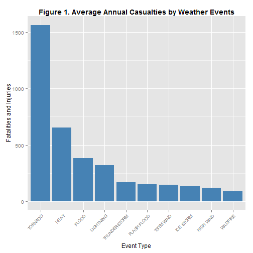
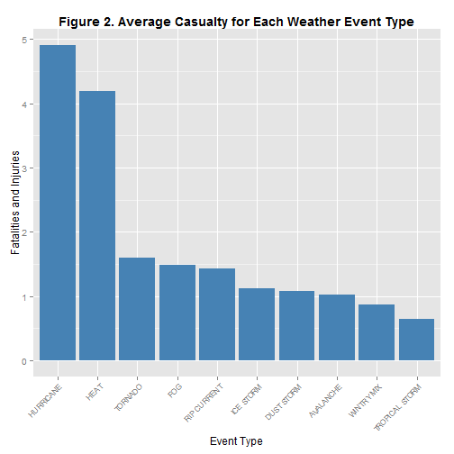
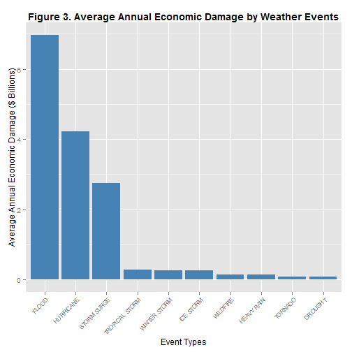

Casualties and Economic Damages from Weather Events Across USA from 1950 to 2011
=============================================================================

Synopsis
========
Weather events such as storms, flood and extreme temperature can have destructive power, but its severity varies widely.  The primary objective of data analysis is to find out which type of weather event is the most destructive in term of casualty and property damage.  The data was provided by National Weather Service, and the data spans from 1950 to 2011.  This analysis showed that Tornados cause the most casualty (fatalities and injuries) annually.  For individual event type, hurricanes cause highest average fatalities and injuries per each event type.  Last, flooding causes the highest average property damage annually.

Introduction
============

Weather events such as storms, flood and extreme temperature can have significant destructive power.  Some events such as Hurricanes have greater destructive power but the number each year is far smaller than flash flood, which has less destructive power, but the number each year is far greater, and cumulative destructive power could still be significant.  In this analysis, the destructive power was estimated by annual casualty (defined as fatalities and injuries combined) and annual property damages from each weather event.  In addition, the average casualty from each weather event was also estimated as the figure represents the severity of the weather event.  The data was provided by National Weather Service and the data spanned from 1950 to 2011.  The data was downloaded from **https://d396qusza40orc.cloudfront.net/repdata%2Fdata%2FStormData.csv.bz2** and was renamed `StormData.csv.bz2`.  The analysis was done with RStudio 0.98.507 and R version 3.0.3.

Data Processing
===============
The data file was compressed in `bz2` format.  The `read.table()` function in R is able to read the compressed file without needing to unzip the file first.

```r
setwd("C:/Users/Michael/Desktop/RR2")
StormData <- read.table("StormData.csv.bz2", header=T, sep = ",")
dim(StormData)
```

```
## [1] 902297     37
```

```r
names(StormData)
```

```
##  [1] "STATE__"    "BGN_DATE"   "BGN_TIME"   "TIME_ZONE"  "COUNTY"    
##  [6] "COUNTYNAME" "STATE"      "EVTYPE"     "BGN_RANGE"  "BGN_AZI"   
## [11] "BGN_LOCATI" "END_DATE"   "END_TIME"   "COUNTY_END" "COUNTYENDN"
## [16] "END_RANGE"  "END_AZI"    "END_LOCATI" "LENGTH"     "WIDTH"     
## [21] "F"          "MAG"        "FATALITIES" "INJURIES"   "PROPDMG"   
## [26] "PROPDMGEXP" "CROPDMG"    "CROPDMGEXP" "WFO"        "STATEOFFIC"
## [31] "ZONENAMES"  "LATITUDE"   "LONGITUDE"  "LATITUDE_E" "LONGITUDE_"
## [36] "REMARKS"    "REFNUM"
```

```r
StormData$BGN_DATE <- as.Date(StormData$BGN_DATE, format = "%m/%d/%Y")
```

`StormData` is a massive file with 902297 rows and 37 columns.  Most of the variables are not needed for the analysis.  The variables of interest are `BGN_DATE`,`EVTYPE`,`FATALITIES`,`INJURIES`,`PROPDMG`,`PROPDMGEXP`,`CROPDMG`,and `CROPDMGEXP. These variables are extracted to a new file `Storm` in order to release unneeded memory and to run faster.  The data in variable `EVTYPE` are messy -- some in lower case letters, some have storm names, some have wind speed.  To be consistent in event types, the similar types were grouped into a single type listed in National Weather Service Instruction for important event types such as hurricane, tornado, heat waves, etc.


```r
Storm <- StormData[,c(2,8,23,24,25,26,27,28)]
rm(StormData)  ##Object removed to free up memory
gc()  ##Garbage collection, reclaimed the freed memory
```

```
##           used (Mb) gc trigger  (Mb)  max used (Mb)
## Ncells  443554 23.7    2327079 124.3   1909003  102
## Vcells 7431280 56.7  128752263 982.4 160940329 1228
```

```r
Storm$EVTYPE <- replace(Storm$EVTYPE, grep("HURRICANE|Hurricane",Storm$EVTYPE), "HURRICANE")
Storm$EVTYPE <- replace(Storm$EVTYPE, grep("TYPHOON",Storm$EVTYPE), "HURRICANE")
Storm$EVTYPE <- replace(Storm$EVTYPE, grep("HIGH WIND|High Wind|STRONG WIND|Strong Wind",Storm$EVTYPE), "HIGH WIND")
Storm$EVTYPE <- replace(Storm$EVTYPE, grep("HEAVY RAIN|Heavy Rain|EXCESSIVE RAIN",Storm$EVTYPE), "HEAVY RAIN")
Storm$EVTYPE <- replace(Storm$EVTYPE, grep("LIGHTNING(.*)",Storm$EVTYPE), "LIGHTNING")
Storm$EVTYPE <- replace(Storm$EVTYPE, grep("TSTM WIND(.*)",Storm$EVTYPE), "TSTM WIND")
Storm$EVTYPE <- replace(Storm$EVTYPE, grep("TORNADO|Tornado",Storm$EVTYPE), "TORNADO")
Storm$EVTYPE <- replace(Storm$EVTYPE, grep("THUNDERSTORM(.*)",Storm$EVTYPE), "THUNDERSTORM")
Storm$EVTYPE <- replace(Storm$EVTYPE, grep("FLASH FLOOD(.*)",Storm$EVTYPE), "FLASH FLOOD")
Storm$EVTYPE <- replace(Storm$EVTYPE, grep("TROPICAL STORM(.*)",Storm$EVTYPE), "TROPICAL STORM")
Storm$EVTYPE <- replace(Storm$EVTYPE, grep("FUNNEL|Funnel",Storm$EVTYPE), "FUNNEL CLOUD")
Storm$EVTYPE <- replace(Storm$EVTYPE, grep("HIGH SURF(.*)|(.*)HIGH TIDE",Storm$EVTYPE), "HIGH SURF")
Storm$EVTYPE <- replace(Storm$EVTYPE, grep("RIP CURRENT(.*)",Storm$EVTYPE), "RIP CURRENT")
Storm$EVTYPE <- replace(Storm$EVTYPE, grep("WILDFIRE|Wildfire|FOREST FIRE|WILD FIRE",Storm$EVTYPE), "WILDFIRE")
Storm$EVTYPE <- replace(Storm$EVTYPE, grep("WINTER WEATHER(.*)|Winter Weather",Storm$EVTYPE), "WINTER WEATHER")
Storm$EVTYPE <- replace(Storm$EVTYPE, grep("^HAIL(.*)",Storm$EVTYPE), "HAIL")
Storm$EVTYPE <- replace(Storm$EVTYPE, grep("^FLOODING|^FLOODS",Storm$EVTYPE), "FLOOD")
Storm$EVTYPE <- replace(Storm$EVTYPE, grep("^HEAT|^Heat",Storm$EVTYPE), "HEAT")
Storm$EVTYPE <- replace(Storm$EVTYPE, grep("HEAVY SURF",Storm$EVTYPE), "HIGH SURF")
Storm$EVTYPE <- replace(Storm$EVTYPE, grep("HEAT$|WARM",Storm$EVTYPE), "HEAT")
Storm$EVTYPE <- replace(Storm$EVTYPE, grep("ICE|Ice|ICY|Icy",Storm$EVTYPE), "ICE STORM")
Storm$EVTYPE <- replace(Storm$EVTYPE, grep("GLAZE|Glaze",Storm$EVTYPE), "ICE STORM")
Storm$EVTYPE <- replace(Storm$EVTYPE, grep("COLD|Cold",Storm$EVTYPE), "COLD WEATHER")
Storm$EVTYPE <- replace(Storm$EVTYPE, grep("^SNOW|^Snow",Storm$EVTYPE), "HEAVY SNOW")
Storm$EVTYPE <- replace(Storm$EVTYPE, grep("HEAVY SNOW",Storm$EVTYPE), "HEAVY SNOW")
Storm$EVTYPE <- replace(Storm$EVTYPE, grep("COASTAL FLOOD(.*)|COASTAL  FLOOD|Coastal Flood",Storm$EVTYPE), "COASTAL FLOODING")
Storm$EVTYPE <- replace(Storm$EVTYPE, grep("STORM SURGE(.*)",Storm$EVTYPE), "STORM SURGE")
Storm$EVTYPE <- replace(Storm$EVTYPE, grep("URBAN(.*)FLOOD|Urban Flood|RIVER FLOOD|River Flood",Storm$EVTYPE), "FLOOD")
Storm$EVTYPE <- replace(Storm$EVTYPE, grep("VOLCANIC(.*)|Volcanic(.*)",Storm$EVTYPE), "VOLCANIC ASH")
```

RESULTS
=======

**Annual Casualties from Weather Events**

After the event types are adjusted, average annual casualties are determined and plotted with `ggplot2`.  Casualties are defined as combined fatalities and injuries

```r
library(lubridate)
Storm$year <- year(Storm$BGN_DATE)  #Extract year of the events
Storm$casualty <- Storm$FATALITIES + Storm$INJURIES
YearlyData <- aggregate(Storm$casualty, list(Storm$year, Storm$EVTYPE), sum) #sum of casualties by event type each year
names(YearlyData) <- c("year","EVTYPE","casualty")
Casualty <- aggregate(YearlyData$casualty, list(YearlyData$EVTYPE), mean) #annual mean casualty
names(Casualty) <- c("EVTYPE","casualty")
sortCasualty <- Casualty[order(Casualty$casualty, decreasing = TRUE),] #sorting the data by decreasing order
sortCasualty$EVTYPE <- factor(sortCasualty$EVTYPE, levels = sortCasualty$EVTYPE, ordered = TRUE)  #to prevent resorting of event types by alphabetical order
library(ggplot2)
p <- ggplot(sortCasualty[1:10,], aes(EVTYPE, casualty)) + geom_bar(fill = "steel blue", stat="identity")  #only top 10 events are plotted
q <- p + ggtitle("Figure 1. Average Annual Casualties by Weather Events") +
     xlab("Event Type") + ylab("Fatalities and Injuries") +
     theme(axis.text.x = element_text(angle = 45, vjust = 1, hjust = 1, size=8), 
     plot.title = element_text(face = "bold"))
print(q)
```

 

```r
head(sortCasualty)
```

```
##           EVTYPE casualty
## 435      TORNADO   1565.2
## 165         HEAT    653.7
## 109        FLOOD    382.9
## 233    LIGHTNING    318.4
## 424 THUNDERSTORM    168.0
## 106  FLASH FLOOD    149.3
```

```r
Storm[Storm$casualty == max(Storm$casualty),]  #maximal casualty by single event type
```

```
##          BGN_DATE  EVTYPE FATALITIES INJURIES PROPDMG PROPDMGEXP CROPDMG
## 157885 1979-04-10 TORNADO         42     1700     250          M       0
##        CROPDMGEXP year casualty
## 157885            1979     1742
```

From the data, `tornado`, which caused average of 1565 fatalies and injuries annually from 1950 to 2011, is the most destructive.  On April 10, 1979, a tornado caused 42 fatalities and 1700 injuries, which is the most casualty from a single weather event.

**Average Casualties from Each Weather Events**

Rare weather event types such as tsunami and some "misclassified event types" are removed from analysis by eliminating the event types that have less than 50 events.  These event types may skew the casualty because they have fewer events.

```r
a <- table(Storm$EVTYPE)  #the named list of event numbers
n <- a[a>50]  #the named list of events with more than 50 events
Storm2 <- subset(Storm, EVTYPE %in% names(n))
dim(Storm2)
```

```
## [1] 900584     10
```

```r
aveCasualty <- aggregate(Storm2$casualty, list(Storm2$EVTYPE), mean) #mean casualty
names(aveCasualty) <- c("EVTYPE","casualty")
sortaveCasualty <- aveCasualty[order(aveCasualty$casualty, decreasing = TRUE),]
sortaveCasualty$EVTYPE <- factor(sortaveCasualty$EVTYPE, levels = sortaveCasualty$EVTYPE, ordered = TRUE)  #to prevent re-sorting of EVTYPE in alphabetic order
p1 <- ggplot(sortaveCasualty[1:10,], aes(EVTYPE, casualty)) + geom_bar(fill = "steel blue", stat = "identity")   #only top 10 events are plotted
q1 <- p1 + ggtitle("Figure 2. Average Casualty for Each Weather Event Type") +
     xlab("Event Type") + ylab("Fatalities and Injuries") +
     theme(axis.text.x = element_text(angle = 45, vjust = 1, hjust = 1, size=8), 
     plot.title = element_text(face = "bold"))
print(q1)
```

 

For individual weather events, `hurricanes` cause the most fatalities and injuries.

**Annual Property Damage from Weather Events**

The multiplying factor for damages was determined by the following function.  Property damages are calculated by multiplying `PROPDMG` and factor determined by the function.  Crop damages are calculated by multiplying `CROPDMG` and the factor.  Combined property and crop damages are entered into a new column `dmg`. 

```r
mult <- function(fact)  {
     if (fact == "1") {f <- 10}
     if (fact == "2"|fact == "h"|fact == "H") {f <- 100}
     if (fact == "3"|fact == "K"|fact == "k") {f <- 1000}
     if (fact == "4") {f <- 1e4}
     if (fact == "5") {f <- 1e5}
     if (fact == "6"|fact == "m"|fact== "M") {f <- 1e6}
     if (fact == "7") {f <- 1e7}
     if (fact == "8") {f <- 1e8}
     if (fact == "B") {f <- 1e9}
     else {f <- 1}
     return(f)
}
y <- rep(0, times = nrow(Storm))  #initializing vector y for property damage
for (i in 1:nrow(Storm)) {
     y[i] <- mult(Storm$PROPDMGEXP[i])
}
z <- rep(0, times = nrow(Storm))  #initializing vector z for crop damage
for (j in 1:nrow(Storm)) {
     z[j] <- mult(Storm$CROPDMGEXP[j])
}
Storm$dmg <- Storm$PROPDMG * y + Storm$CROPDMG * z
Costs <- aggregate(Storm$dmg, list(Storm$year, Storm$EVTYPE), sum) #Economic damage by each event type by year
names(Costs) <- c("year","EVTYPE","dmg")
AnnCost <- aggregate(Costs$dmg, list(Costs$EVTYPE), mean) #Average annual economic damage by each event type
names(AnnCost) <- c("EVTYPE","dmg")
sortAnnCost <- AnnCost[order(AnnCost$dmg, decreasing = TRUE),]  #Sort from highest to lowest
sortAnnCost$EVTYPE <- factor(sortAnnCost$EVTYPE, levels = sortAnnCost$EVTYPE, ordered = TRUE)  #To prevent re-sorting in ggplot
sortAnnCost$dmg <- sortAnnCost$dmg * 1e-9  #converting to billions of dollars
head(sortAnnCost, 10)
```

```
##             EVTYPE     dmg
## 109          FLOOD 6.97374
## 199      HURRICANE 4.21722
## 347    STORM SURGE 2.73883
## 440 TROPICAL STORM 0.27106
## 497   WINTER STORM 0.26316
## 205      ICE STORM 0.26316
## 484       WILDFIRE 0.13369
## 172     HEAVY RAIN 0.13158
## 435        TORNADO 0.08554
## 61         DROUGHT 0.07895
```

`Flood`, with average economic damage of $7 Billions annually across US, is the weather event type that causes most economic damage annually.

Plotting Figure 3.

```r
p2 <- ggplot(sortAnnCost[1:10,], aes(EVTYPE, dmg)) + geom_bar(fill = "steel blue", stat = "identity")
q2 <- p2 + ggtitle("Figure 3. Average Annual Economic Damage by Weather Events") +
     xlab("Event Types") + ylab("Average Annual Economic Damage ($ Billions)") +
     theme(plot.title = element_text(face = "bold"),
           axis.text.x = element_text(angle = 45, vjust = 1, hjust = 1, size = 8))
print(q2)
```

 
